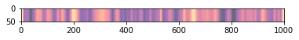
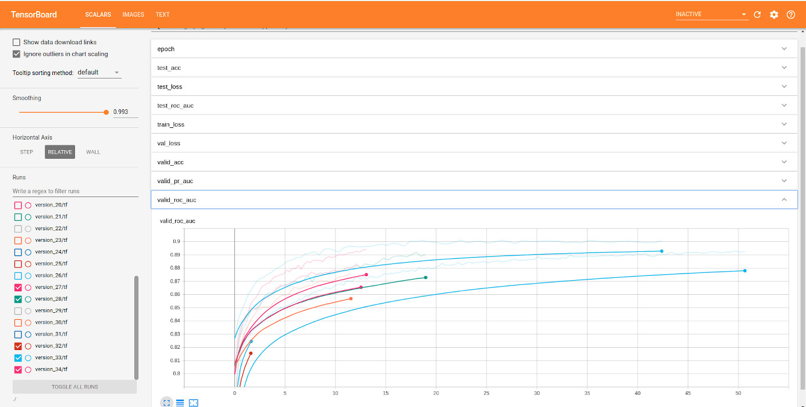
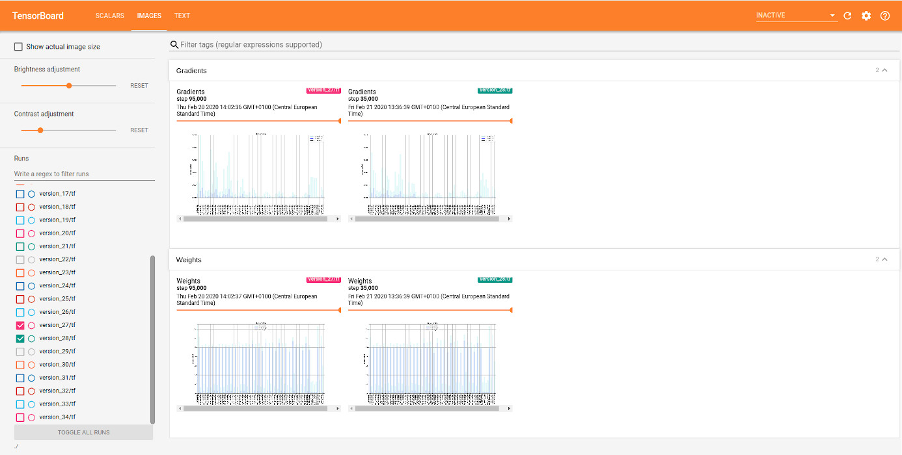
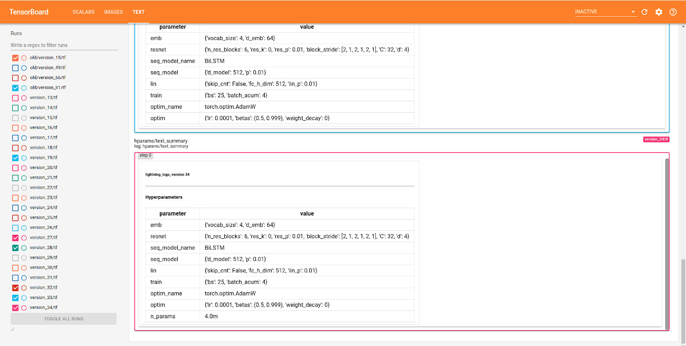

# Classifying non-coding DNA sequences

## Introduction

Classification of non-coding DNA sequences using a combination of deep learning architectures: WideResNet, Transformer-XL and fully connected layers with skip-connections. To learn about the implementation follow the order in the folder /notebooks and read the extensive explanation that is given in the project_report.pdf.

## Results explainability

There is also an implementation of [Grad-CAM](https://arxiv.org/abs/1610.02391) to visualize what are the parts of the sequence responsible for the prediction for a choosen target in the notebook 5. Sample:

As we see in this example we have two parts of the sequence (around 200 and 650) making big impact on the final decision. This can be used to assure our model is working properly, to debug or to discover de-novo sequences targets.

## Requirements

### Dataset

[DeepSEA dataset](http://deepsea.princeton.edu/media/code/deepsea_train_bundle.v0.9.tar.gz): GRCh37 reference genome with targets extracted from ChIp-seq and Dnase-seq peak sets from the ENCODE and Roadmap Epigenomics data, with 919 binary targets for TF binding (104), DNase I sensitivity (125) and histone-mark profiles (690).

### Libraries

* H5py: loads data directly from a hard drive allowing the use of bigger datasets.

* [PyTorch](https://github.com/pytorch/pytorch): deep learning framework.

* [Pytorch Lightning](https://github.com/PyTorchLightning/pytorch-lightning): PyTorch wrapper to write less boilerplate.

* [Transformer](https://github.com/huggingface/transformers): Hugging Face library of transformer implementations.

* [Apex](https://github.com/NVIDIA/apex) (optional): Nvidia mixed precision training library for PyTorch, used to speed training and reduce memory consumption.

To install all the required libraries: `conda create -n new environment --file req.txt`

## Additional

Model parameters: (Link not available yet)

Tooling: the training loop are equiping with loggers to keep track of hyperparameters, basic metrics and advanced metrics as weights and gradients by layer and time:

